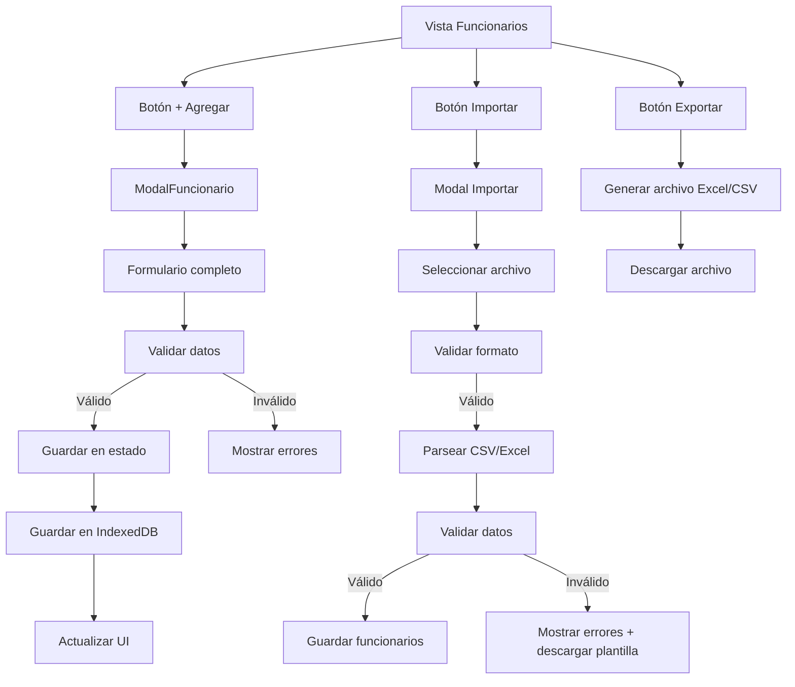
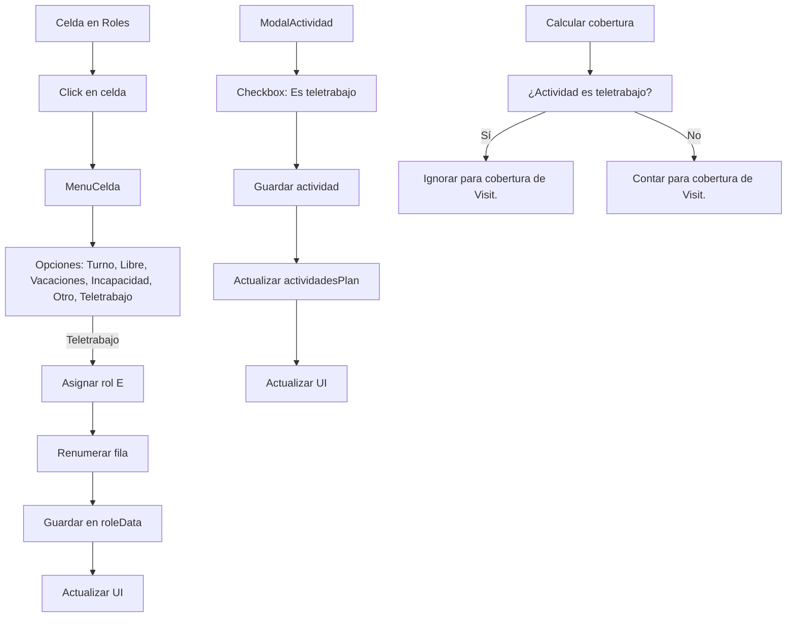
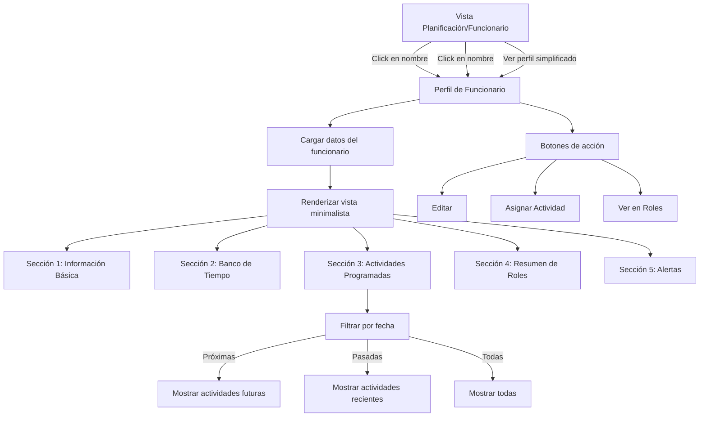
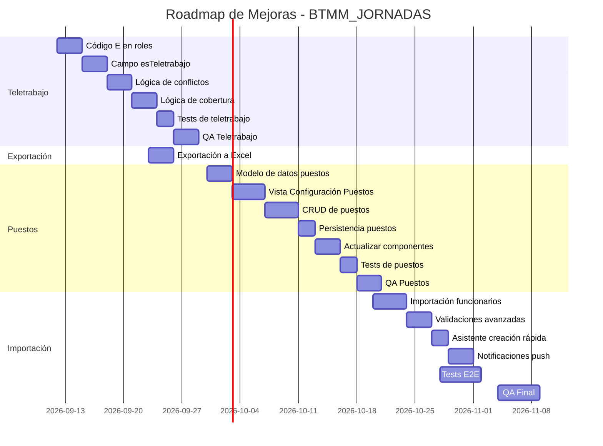
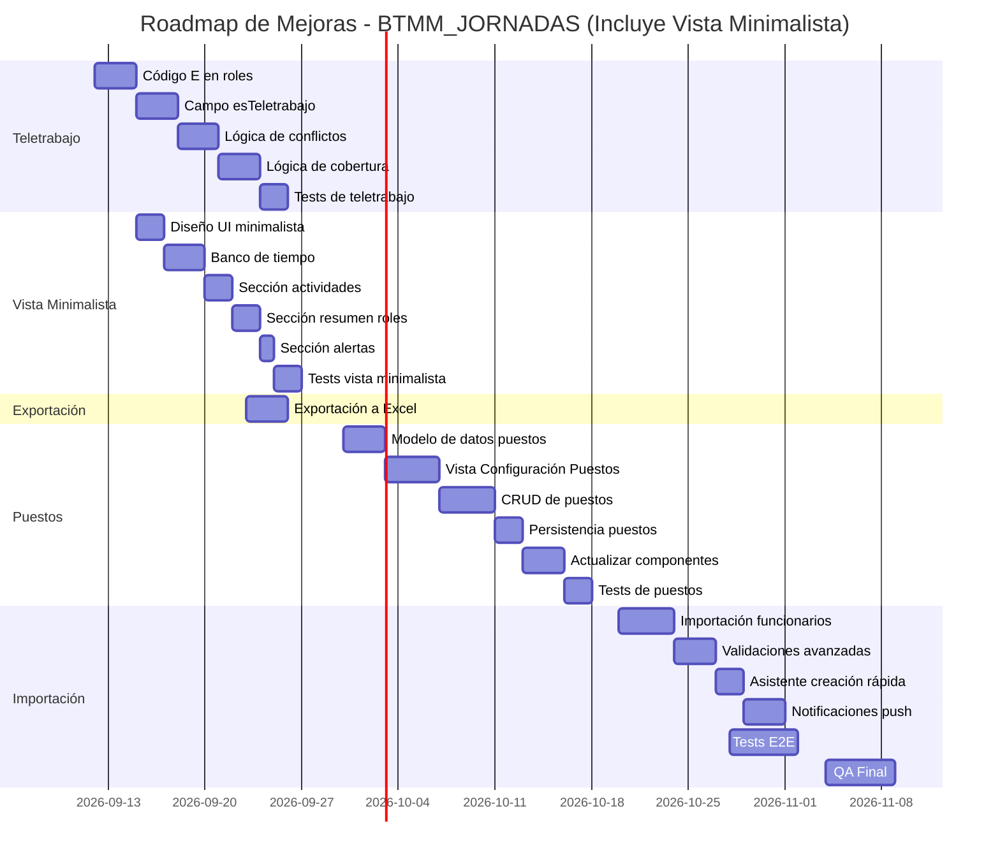

# 📋 DOCUMENTO DE MEJORAS PROPUESTAS 
# PNLQ – Gestión de Jornadas Laborales (BTMM)

> **Versión del documento**: 1.0  
> **Fecha**: 11 de septiembre de 2026  
> **Estado**: Borrador para revisión  
> **Solicitante**: Usuario del sistema BTMM_JORNADAS  

---

## 📌 ÍNDICE

1. [Contexto y Objetivos](#1-contexto-y-objetivos)
2. [Mejoras Existentes Identificadas](#2-mejoras-existentes-identificadas)
3. [Nuevas Funcionalidades Solicitadas](#3-nuevas-funcionalidades-solicitadas)
   - [3.1 Control Dinámico de Funcionarios](#31-control-dinámico-de-funcionarios)
   - [3.2 Control Dinámico de Centros Operativos (Puestos)](#32-control-dinámico-de-centros-operativos-puestos)
   - [3.3 Gestión de Actividades en Teletrabajo](#33-gestión-de-actividades-en-teletrabajo)
4. [Detalles Técnicos de Implementación](#4-detalles-técnicos-de-implementación)
5. [Priorización y Roadmap](#5-priorización-y-roadmap)
6. [Impacto y Beneficios](#6-impacto-y-beneficios)
7. [Riesgos y Mitigaciones](#7-riesgos-y-mitigaciones)
8. [Checklist de Verificación](#8-checklist-de-verificación)

---

---

## 1. CONTEXTO Y OBJETIVOS

### 1.1 Propósito del Documento
Este documento recopila **todas las mejoras propuestas** para el sistema **PNLQ – Gestión de Jornadas Laborales**, incluyendo:
- Mejoras identificadas durante el análisis técnico del repositorio.
- **Nuevas funcionalidades solicitadas específicamente**:
  - Control dinámico para **agregar/quitar funcionarios**.
  - Control dinámico para **agregar/quitar centros operativos (puestos)**.
  - Opción para **crear/marcar actividades en teletrabajo**.

### 1.2 Principios Rectores
1. **No pérdida funcional**: Ningún indicador, alerta o funcionalidad existente puede desaparecer.
2. **Consistencia con el marco normativo**: Todas las mejoras respetan que la herramienta **solo registra y alerta**; no ejecuta pagos, suspensiones ni derechos automáticos.
3. **Enfoque en usabilidad**: Mejoras orientadas a usuarios operativos (guardaparques), administrativos y de jefatura.
4. **Mantenibilidad**: Código limpio, testable y documentado.

### 1.3 Alcance
| **Tipo**               | **Cantidad** | **Detalle**                                                                                     |
|------------------------|--------------|-------------------------------------------------------------------------------------------------|
| Mejoras existentes      | 12           | Identificadas en el análisis técnico (ver [Sección 2](#2-mejoras-existentes-identificadas)). |
| Nuevas funcionalidades | 4            | Solicitadas específicamente (ver [Sección 3](#3-nuevas-funcionalidades-solicitadas)).          |
| **Total**              | **16**       |                                                                                                 |

---

---

## 2. MEJORAS EXISTENTES IDENTIFICADAS

### 2.1 Mejoras de Prioridad Alta (Impacto Alto / Esfuerzo Bajo-Medio)

| **ID** | **Mejora**                          | **Descripción**                                                                                     | **Esfuerzo** | **Impacto**               | **Archivos Relacionados**          |
|--------|-------------------------------------|-----------------------------------------------------------------------------------------------------|--------------|---------------------------|------------------------------------|
| **A1** | Sincronización con backend SINAC   | Centralizar datos en un backend institucional para respaldo en la nube y colaboración en tiempo real. | Alto (4-6 semanas) | ⭐⭐⭐⭐⭐ | `src/lib/sync.js` (nuevo)        |
| **A2** | Pruebas E2E con Playwright         | Implementar pruebas end-to-end para flujos críticos (crear funcionario, resolver conflicto, etc.). | Medio (2-3 semanas) | ⭐⭐⭐⭐ | `playwright.config.js` (nuevo)   |
| **A3** | Virtualización de tablas          | Mejorar rendimiento en dispositivos de gama baja para vistas como **Roles** y **Planificación**. | Medio (1-2 semanas) | ⭐⭐⭐⭐ | `src/features/roles/Roles.jsx`    |
| **A4** | Autenticación + Auditoría           | Añadir login y registro de cambios (quién modificó qué y cuándo).                                | Alto (3-4 semanas) | ⭐⭐⭐⭐ | `src/context/AuthContext.jsx`    |

### 2.2 Mejoras de Prioridad Media (Impacto Medio / Esfuerzo Bajo)

| **ID** | **Mejora**                          | **Descripción**                                                                                     | **Esfuerzo** | **Impacto**               | **Archivos Relacionados**          |
|--------|-------------------------------------|-----------------------------------------------------------------------------------------------------|--------------|---------------------------|------------------------------------|
| **B1** | Exportación a Excel/CSV            | Permitir exportar datos (funcionarios, roles, actividades) a formatos Excel o CSV.                     | Bajo (1-2 días) | ⭐⭐⭐ | `src/features/datos/Datos.jsx`   |
| **B2** | Notificaciones push                | Alertas proactivas (ej: "Disponibilidad vence mañana") usando Service Worker.                        | Bajo (2-3 días) | ⭐⭐⭐ | `PWAWrapper.jsx`                 |
| **B3** | Optimización de bundle             | Reducir tamaño del CSS generado por Tailwind.                                                   | Bajo (1-2 días) | ⭐⭐ | `tailwind.config.js`             |
| **B4** | Búsqueda avanzada en Funcionarios | Filtros combinados (ej: "Activos + Brigada + con disponibilidad").                               | Bajo (3-5 días) | ⭐⭐⭐ | `src/features/funcionarios/Funcionarios.jsx` |

### 2.3 Mejoras de Prioridad Baja (Impacto Bajo / Esfuerzo Variable)

| **ID** | **Mejora**                          | **Descripción**                                                                                     | **Esfuerzo** | **Impacto**               | **Archivos Relacionados**          |
|--------|-------------------------------------|-----------------------------------------------------------------------------------------------------|--------------|---------------------------|------------------------------------|
| **C1** | Modo kiosko                        | Vista simplificada para pantallas públicas (ej: recepción del parque).                             | Medio (1 semana) | ⭐⭐ | `src/features/kiosko/` (nuevo)   |
| **C2** | Integración con Google Calendar    | Sincronizar actividades con calendarios externos.                                              | Alto (4-6 semanas) | ⭐⭐ | `src/lib/googleCalendar.js`     |
| **C3** | Dashboard personalizable           | Permitir al usuario elegir qué KPIs ver en el dashboard.                                        | Medio (1 semana) | ⭐⭐ | `src/features/dia/DiaLayout.jsx`  |
| **C4** | Soporte para múltiples áreas       | Extender el modelo para otras áreas del SINAC (no solo BTMM).                                  | Alto (4-6 semanas) | ⭐⭐ | `src/data/puestos.js`            |

---

---

## 3. NUEVAS FUNCIONALIDADES SOLICITADAS

> ⚠️ **Estas son las mejoras solicitadas específicamente en la última petición.**

---

### 3.1 Control Dinámico de Funcionarios

#### 3.1.1 Descripción
Actualmente, el sistema permite **agregar, editar y eliminar funcionarios** a través de la vista **Funcionarios** (`src/features/funcionarios/Funcionarios.jsx`). Sin embargo, se propone **mejorar esta funcionalidad** con:
- **Importación masiva** desde Excel/CSV.
- **Exportación masiva** de funcionarios.
- **Validaciones avanzadas** (ej: cédula única, correo válido).
- **Asistente de creación rápida** (formulario simplificado para campo).

#### 3.1.2 Requisitos Funcionales
| **ID** | **Requisito**                                                                                     | **Prioridad** | **Estado Actual** | **Complejidad** |
|--------|---------------------------------------------------------------------------------------------------|---------------|-------------------|-----------------|
| RF1    | Crear nuevo funcionario con todos los campos (nombre, cédula, correo, cargo, etc.).                 | ⭐⭐⭐⭐⭐ | ✅ Implementado | Baja            |
| RF2    | Editar funcionario existente.                                                                       | ⭐⭐⭐⭐⭐ | ✅ Implementado | Baja            |
| RF3    | Eliminar funcionario con confirmación.                                                           | ⭐⭐⭐⭐⭐ | ✅ Implementado | Baja            |
| RF4    | **Importar funcionarios desde Excel/CSV** (nuevo).                                                | ⭐⭐⭐⭐ | ❌ No implementado | Media           |
| RF5    | **Exportar funcionarios a Excel/CSV** (nuevo).                                                    | ⭐⭐⭐⭐ | ❌ No implementado | Baja            |
| RF6    | Validación de cédula única (no duplicada).                                                         | ⭐⭐⭐ | ✅ Parcial | Baja            |
| RF7    | Validación de correo electrónico.                                                                 | ⭐⭐⭐ | ✅ Parcial | Baja            |
| RF8    | **Asistente de creación rápida** (solo campos esenciales para uso en campo).                     | ⭐⭐⭐ | ❌ No implementado | Baja            |
| RF9    | **Búsqueda por múltiples criterios** (nombre, cédula, puesto, estado, etc.).                       | ⭐⭐⭐⭐ | ✅ Implementado | Baja            |
| RF10   | **Filtros rápidos** (Activos, Inactivos, con disponibilidad, etc.).                               | ⭐⭐⭐⭐ | ✅ Implementado | Baja            |

#### 3.1.3 Campos de Funcionario
| **Campo**               | **Tipo**         | **Obligatorio** | **Descripción**                                                                                     | **Validación**                          |
|-------------------------|------------------|-----------------|-----------------------------------------------------------------------------------------------------|----------------------------------------|
| Nombre                  | Texto            | ✅ Sí           | Nombre completo del funcionario.                                                                     | Mínimo 2 caracteres.                    |
| Cédula                  | Texto            | ✅ Sí           | Identificación única (formato: `1-2345-6789`).                                                      | Formato válido + única.                |
| Correo                  | Texto            | ❌ No           | Correo electrónico institucional.                                                                     | Formato de email válido.              |
| Cargo                   | Select           | ✅ Sí           | Cargo en el SINAC (ej: Guardaparques, Administrativo).                                           | -                                      |
| Puesto Operativo        | Select           | ✅ Sí           | Centro operativo al que pertenece (ej: Puesto Orosi).                                             | -                                      |
| Condición               | Select           | ✅ Sí           | Propiedad / Interino / ONG-Invest-Volunt.                                                            | -                                      |
| Jornada                 | Select           | ✅ Sí           | Ordinaria / Acumulativa.                                                                             | -                                      |
| Modalidad               | Select           | ❌ No*          | Solo para Acumulativa (ej: 10x5, 12x6).                                                            | -                                      |
| Resolución              | Texto            | ❌ No           | Número de resolución (para Acumulativa).                                                           | -                                      |
| Contrato                | Texto            | ❌ No           | Número de contrato de disponibilidad.                                                              | -                                      |
| Vencimiento             | Fecha            | ❌ No           | Fecha de vencimiento del contrato.                                                                   | Fecha válida.                          |
| Ingreso                 | Fecha            | ❌ No           | Fecha de ingreso al SINAC.                                                                          | Fecha válida.                          |
| Disponibilidad          | Boolean          | ❌ No           | ¿Tiene contrato de disponibilidad?                                                                   | -                                      |
| Autoridad de Policía     | Boolean          | ❌ No           | ¿Tiene autoridad de policía?                                                                         | -                                      |
| Brigada Forestal        | Boolean          | ❌ No           | ¿Pertenece a brigada forestal?                                                                     | -                                      |
| Estado                  | Select           | ✅ Sí           | Activo / Inactivo / De vacaciones / Incapacitado.                                                   | -                                      |
| Observaciones           | Texto            | ❌ No           | Notas adicionales.                                                                                  | -                                      |

> *: Obligatorio si Jornada = Acumulativa.

#### 3.1.4 Interfaz de Usuario (UI)
- **Vista actual**: Tabla con scroll horizontal (escritorio) o tarjetas (móvil).
- **Mejoras propuestas**:
  - **Botón "Importar"**: Abre modal para subir archivo Excel/CSV.
  - **Botón "Exportar"**: Descarga archivo Excel/CSV con los funcionarios actuales.
  - **Botón "Crear Rápido"**: Formulario simplificado con solo campos esenciales (nombre, cédula, puesto, estado).
  - **Validaciones en tiempo real**: Mensajes de error claros al intentar guardar datos inválidos.

#### 3.1.5 Ejemplo de Archivo CSV para Importación
```csv
nombre,cedula,correo,cargo,puesto,condicion,jornada,modalidad,resolucion,contrato,vencimiento,ingreso,disponibilidad,policia,brigada,estado,observaciones
Juan Pérez,1-2345-6789,juan.perez@sinac.go.cr,Guardaparques,Puesto Orosi,Propiedad,Ordinaria,,,,,,true,false,Activo,
María López,2-3456-7890,maria.lopez@sinac.go.cr,Administrativo,Puesto Quetzales,Interino,Acumulativa,10x5,RES-2026-001,DISP-2026-001,2026-12-31,2025-01-15,true,true,true,false,Activo,Contrato renovado
```

#### 3.1.6 Diagramas de Flujo


---

### 3.2 Control Dinámico de Centros Operativos (Puestos)

#### 3.2.1 Descripción
Actualmente, los **centros operativos (puestos)** están **hardcodeados** en `src/data/puestos.js`:
```javascript
// src/data/puestos.js
export const puestosOperativos = [
  { id: "OR", nombre: "Puesto Orosi", color: "bg-orange-100", requiereVisit: true },
  { id: "QZ", nombre: "Puesto Quetzales", color: "bg-orange-200", requiereVisit: true },
  { id: "LE", nombre: "Puesto Esperanza", color: "bg-sky-100", requiereVisit: false },
];
```

Se propone **migrar a un sistema dinámico** donde los puestos puedan ser:
- **Agregados** (nuevos centros operativos).
- **Editados** (cambiar nombre, color, si requiere Visit.).
- **Eliminados** (con validación: no permitir eliminar si hay funcionarios asignados).
- **Configurados** (qué puestos requieren atención rutinaria de visitantes).

#### 3.2.2 Requisitos Funcionales
| **ID** | **Requisito**                                                                                     | **Prioridad** | **Estado Actual** | **Complejidad** |
|--------|---------------------------------------------------------------------------------------------------|---------------|-------------------|-----------------|
| RP1    | Listar todos los puestos operativos.                                                             | ⭐⭐⭐⭐⭐ | ✅ Implementado | Baja            |
| RP2    | **Agregar nuevo puesto** (nombre, color, requiere Visit.).                                         | ⭐⭐⭐⭐⭐ | ❌ No implementado | Media           |
| RP3    | **Editar puesto existente** (nombre, color, requiere Visit.).                                     | ⭐⭐⭐⭐⭐ | ❌ No implementado | Media           |
| RP4    | **Eliminar puesto** (con confirmación y validación: no permitir si hay funcionarios asignados).   | ⭐⭐⭐⭐⭐ | ❌ No implementado | Media           |
| RP5    | Configurar qué puestos requieren **atención rutinaria de visitantes (Visit.)**.                   | ⭐⭐⭐⭐⭐ | ✅ Parcial (hardcodeado) | Baja            |
| RP6    | **Persistencia de puestos** (guardar en IndexedDB/localStorage).                                | ⭐⭐⭐⭐⭐ | ❌ No implementado | Media           |
| RP7    | Validación: Nombre único.                                                                       | ⭐⭐⭐ | ❌ No implementado | Baja            |
| RP8    | Validación: Color válido (formato hex o nombre de Tailwind).                                    | ⭐⭐ | ❌ No implementado | Baja            |

#### 3.2.3 Modelo de Datos para Puestos
```typescript
interface PuestoOperativo {
  id: string;          // Identificador único (ej: "OR", "QZ")
  nombre: string;      // Nombre completo (ej: "Puesto Orosi")
  color: string;       // Color en formato Tailwind (ej: "bg-orange-100") o hex (ej: "#FED7AA")
  requiereVisit: boolean; // ¿Requiere atención rutinaria de visitantes?
  creadoEn: string;     // Fecha de creación (ISO)
  actualizadoEn: string; // Fecha de última actualización (ISO)
}
```

#### 3.2.4 Interfaz de Usuario (UI)
Se propone añadir una **nueva vista: "Configuración de Puestos"** (accesible desde **Configuración** o **Datos**):
- **Tabla de puestos**: Lista todos los puestos con columnas (Nombre, Color, Requiere Visit., Acciones).
- **Botón "+ Agregar Puesto"**: Abre modal para crear nuevo puesto.
- **Acciones por fila**:
  - ✏️ **Editar**: Abre modal para modificar el puesto.
  - 🗑️ **Eliminar**: Con confirmación (validar que no haya funcionarios asignados).
- **Toggle "Requiere Visit."**: Cambiar dinámicamente si el puesto requiere atención rutinaria.

#### 3.2.5 Impacto en el Sistema
| **Componente**               | **Cambio Requerido**                                                                                     | **Esfuerzo** |
|------------------------------|---------------------------------------------------------------------------------------------------------|--------------|
| `src/data/puestos.js`        | Eliminar hardcodeo. Reemplazar por función que lea de estado global.                                   | Medio        |
| `src/context/AppContext.jsx`| Añadir `puestos` al estado global + acciones para gestionarlos.                                         | Medio        |
| `src/features/configuracion/Configuracion.jsx` | Añadir pestaña "Puestos Operativos" con CRUD.                                                      | Alto         |
| `src/features/roles/Roles.jsx` | Usar `puestos` dinámicos en lugar de hardcodeados.                                                     | Bajo         |
| `src/features/funcionarios/ModalFuncionario.jsx` | Usar `puestos` dinámicos en el selector de puesto.                                                   | Bajo         |
| `src/domain/cobertura.js`     | Usar `puestos` dinámicos para validar cobertura de Visit.                                             | Bajo         |
| `src/lib/storage.js`         | Añadir `puestos` al snapshot de persistencia.                                                           | Bajo         |

#### 3.2.6 Diagramas de Flujo
```mermaid
graph TD
    A[Vista Configuración] --> B[Pestaña Puestos]
    B --> C[Tabla de Puestos]
    C --> D[Botón + Agregar]
    D --> E[Modal Crear Puesto]
    E --> F[Formulario: Nombre, Color, Requiere Visit.]
    F --> G[Validar datos]
    G -->|Válido| H[Guardar puesto]
    G -->|Inválido| I[Mostrar errores]
    H --> J[Actualizar estado global]
    J --> K[Actualizar UI]
    
    C --> L[Acciones: Editar/Eliminar]
    L --> M[Modal Editar Puesto]
    M --> N[Formulario pre-cargado]
    N --> O[Guardar cambios]
    
    L --> P[Confirmar Eliminar]
    P --> Q[Validar: ¿Hay funcionarios asignados?]
    Q -->|Sí| R[Mostrar error: "No se puede eliminar, hay funcionarios asignados"]
    Q -->|No| S[Eliminar puesto]
```

---

### 3.3 Gestión de Actividades en Teletrabajo

---

### 3.4 Vista Minimalista de Funcionario

#### 3.3.1 Descripción
Actualmente, el sistema soporta **5 códigos de rol** para los funcionarios:
- `T` → Turno (activo)
- `L` → Libre
- `V` → Vacaciones
- `I` → Incapacidad
- `O` → Otro

Se propone añadir un **nuevo código de rol**:
- `E` → **Teletrabajo** (nuevo)

Además, se permitirá **marcar actividades como teletrabajo**, lo que afectará:
- **Visualización**: Badge específico para teletrabajo.
- **Conflictos**: Una actividad en teletrabajo **no generará conflicto** si el rol del funcionario es `E` (Teletrabajo).
- **Cobertura**: Las actividades en teletrabajo **no contarán** para la cobertura de atención rutinaria de visitantes (Visit.).

#### 3.3.2 Requisitos Funcionales
| **ID** | **Requisito**                                                                                     | **Prioridad** | **Estado Actual** | **Complejidad** |
|--------|---------------------------------------------------------------------------------------------------|---------------|-------------------|-----------------|
| RT1    | Añadir código de rol **`E` (Teletrabajo)**.                                                       | ⭐⭐⭐⭐⭐ | ❌ No implementado | Media           |
| RT2    | Añadir opción **"Teletrabajo"** en el menú de celda (`MenuCelda.jsx`).                           | ⭐⭐⭐⭐⭐ | ❌ No implementado | Baja            |
| RT3    | Añadir **badge de teletrabajo** (color morado o similar) en celdas con rol `E`.                  | ⭐⭐⭐⭐ | ❌ No implementado | Baja            |
| RT4    | Añadir opción **"Es teletrabajo"** en el formulario de actividad (`ModalActividad.jsx`).         | ⭐⭐⭐⭐⭐ | ❌ No implementado | Media           |
| RT5    | **Actividades en teletrabajo no generan conflicto** si el rol es `E`.                          | ⭐⭐⭐⭐⭐ | ❌ No implementado | Media           |
| RT6    | **Actividades en teletrabajo no cuentan para cobertura de Visit.**.                             | ⭐⭐⭐⭐⭐ | ❌ No implementado | Media           |
| RT7    | Validación: Un funcionario no puede tener rol `E` en un puesto que **requiere Visit.**.         | ⭐⭐⭐ | ❌ No implementado | Media           |
| RT8    | **Renumeración automática** para rol `E` (ej: `E1`, `E2`, ...).                                  | ⭐⭐⭐⭐ | ❌ No implementado | Media           |

#### 3.3.3 Modelo de Datos
1. **Nuevo código de rol**:
   ```javascript
   // En src/domain/roles.js
   export const CATEGORIAS_ROL = {
     T: { nombre: "Turno", color: "bg-emerald-100", texto: "text-emerald-800" },
     L: { nombre: "Libre", color: "bg-amber-100", texto: "text-amber-800" },
     V: { nombre: "Vacaciones", color: "bg-sky-100", texto: "text-sky-800" },
     I: { nombre: "Incapacidad", color: "bg-red-100", texto: "text-red-800" },
     O: { nombre: "Otro", color: "bg-violet-100", texto: "text-violet-800" },
     E: { nombre: "Teletrabajo", color: "bg-purple-100", texto: "text-purple-800" }, // Nuevo
   };
   ```

2. **Campo en actividades**:
   ```javascript
   // En src/data/seedActividades.js (y en el modelo de actividad)
   {
     id: "act-001",
     titulo: "Reunión virtual",
     lugar: "Online",
     fechaInicio: "2026-09-15",
     fechaFin: "2026-09-15",
     viatico: false,
     esTeletrabajo: true, // Nuevo campo
     funcionarios: ["Juan Pérez", "María López"],
   }
   ```

#### 3.3.4 Interfaz de Usuario (UI)
1. **Menú de Celda (`MenuCelda.jsx`)**:
   - Añadir opción **"Teletrabajo"** al menú contextual.
   - Icono: `🏠` o SVG de casa (usando `lucide-react`).
   - Color: Morado (`bg-purple-100`).

2. **Modal de Actividad (`ModalActividad.jsx`)**:
   - Añadir checkbox **"Es teletrabajo"**.
   - Si está marcado, mostrar mensaje: "Esta actividad no contará para cobertura de Visit.".

3. **Visualización en Roles**:
   - Celda con rol `E` mostrará badge morado con `E1`, `E2`, etc.
   - Tooltip: "Teletrabajo".

4. **Visualización en Planificación**:
   - Actividades marcadas como teletrabajo mostrarán badge morado **"🏠 Teletrabajo"**.

5. **Visualización en Día**:
   - En el listado de actividades, mostrar badge **"🏠 Teletrabajo"** para actividades en teletrabajo.

#### 3.3.5 Lógica de Negocio
1. **Renumeración automática**:
   - Al editar una celda a `E`, el sistema renumerará la fila respetando la modalidad (ej: `E1`, `E2`, `E3`, ...).
   - Ejemplo: Si un funcionario tiene modalidad `10x5`, los primeros 10 días serán `T1` a `T10`, los siguientes 5 días `L1` a `L5`, y luego podría tener `E1`, `E2`, etc. (si se configura así).

2. **Conflictos**:
   - Una actividad **no generará conflicto** si:
     - El rol del funcionario es `E` (Teletrabajo).
     - La actividad está marcada como `esTeletrabajo: true`.

3. **Cobertura de Visit.**:
   - Las actividades marcadas como `esTeletrabajo: true` **no contarán** para el cálculo de cobertura de atención rutinaria de visitantes.

4. **Validación en puestos con Visit.**:
   - Un funcionario **no puede tener rol `E`** en un puesto que **requiere atención rutinaria de visitantes** (ej: Puesto Orosi, Puesto Quetzales).
   - Si se intenta asignar `E` en un puesto con `requiereVisit: true`, mostrar mensaje de error: "No se puede asignar teletrabajo en un puesto que requiere atención rutinaria de visitantes".

#### 3.3.6 Diagramas de Flujo


---

#### 3.4.1 Descripción
Se propone una **nueva vista dedicada** llamada **"Perfil de Funcionario"** (o "Detalle de Funcionario"), accesible desde:
- La lista de **Funcionarios** (haciendo clic en el nombre de un funcionario).
- La vista **Roles** (haciendo clic en el nombre de un funcionario en la tabla).
- La vista **Planificación/Funcionario** (opción alternativa simplificada).

El objetivo es ofrecer una **vista ultra-limpia, minimalista y enfocada** que muestre **solo la información esencial** de un funcionario, sin saturación visual, ideal para:
- **Consulta rápida** en campo (móvil).
- **Revisión de banco de tiempo** (acumulado a favor).
- **Historial de actividades programadas**.
- **Resumen de roles asignados**.

#### 3.4.2 Requisitos Funcionales
| **ID** | **Requisito** | **Prioridad** | **Estado Actual** | **Complejidad** |
|--------|--------------|---------------|-------------------|-----------------|
| VF1    | Mostrar información básica del funcionario (nombre, cédula, cargo, puesto, estado). | ⭐⭐⭐⭐⭐ | ❌ No implementado | Baja |
| VF2    | Mostrar **banco de tiempo a favor** (días acumulados de turno no usados). | ⭐⭐⭐⭐⭐ | ❌ No implementado | Media |
| VF3    | Mostrar **actividades programadas** (próximas y pasadas) con filtros por fecha. | ⭐⭐⭐⭐⭐ | ❌ No implementado | Media |
| VF4    | Mostrar **resumen de roles** (distribución T/L/V/I/O/E por mes). | ⭐⭐⭐⭐ | ❌ No implementado | Media |
| VF5    | Mostrar **alertas específicas** del funcionario (ej: disponibilidad por vencer). | ⭐⭐⭐⭐ | ❌ No implementado | Baja |
| VF6    | **Diseño minimalista**: Sin tablas complejas, solo tarjetas y listas limpias. | ⭐⭐⭐⭐⭐ | ❌ No implementado | Baja |
| VF7    | **Navegación rápida**: Botones para ir a "Editar", "Asignar actividad", "Ver en Roles". | ⭐⭐⭐⭐ | ❌ No implementado | Baja |
| VF8    | **Modo móvil optimizado**: Diseño responsive para pantallas pequeñas. | ⭐⭐⭐⭐⭐ | ❌ No implementado | Baja |

#### 3.4.3 Información a Mostrar
La vista se dividirá en **4 secciones principales**, cada una en una tarjeta limpia:

1. **📋 Información Básica**
   - Avatar + Nombre completo.
   - Cédula + Correo.
   - Cargo + Puesto operativo.
   - Condición (Propiedad/Interino/ONG) + Jornada/Modalidad.
   - Estado (Activo/Inactivo/De vacaciones/Incapacitado).
   - Atributos (Policía, Brigada, Disponibilidad).

2. **⏳ Banco de Tiempo a Favor**
   - **Días acumulados**: Total de días de turno no usados (para modalidades acumulativas).
   - **Próximo vencimiento**: Fecha límite para usar el banco de tiempo (si aplica).
   - **Detalle por mes**: Lista de meses con días acumulados.
   - **Notas**: "Este banco de tiempo puede usarse para compensar días libres o vacaciones".

3. **📅 Actividades Programadas**
   - **Próximas actividades**: Lista de actividades futuras (con fecha, título, lugar).
   - **Actividades pasadas**: Lista de actividades recientes (últimos 30 días).
   - **Filtros**: Por fecha (próximas/pasadas/todas).
   - **Badges**: Viático (💰), Teletrabajo (🏠), Conflicto (⚠️).

4. **📊 Resumen de Roles**
   - **Distribución mensual**: Gráfico simple de barras o pastel con % de T/L/V/I/O/E.
   - **Próximos roles**: Calendario mini de los próximos 15 días (con colores por tipo).
   - **INICIO**: Destacar el primer día laboral del mes actual.
   - **Alertas**: "Tienes 3 días de turno seguidos sin actividad asignada".

#### 3.4.4 Diseño Visual (Mockup)
```
+---------------------------------------------------+
|  [← Volver]    PERFIL DE FUNCIONARIO               |
+---------------------------------------------------+
|                                                   |
|  +---------------+  +-----------------------------+ |
|  |               |  |  Juan Pérez García          | |
|  |   👤         |  |  Guardaparques              | |
|  |   (Avatar)    |  |  Puesto Orosi               | |
|  |               |  |  Activo ✅                  | |
|  +---------------+  +-----------------------------+ |
|                                                   |
+-------------------+-------------------------------+
|                                                   |
|  📋 INFORMACIÓN BÁSICA                            |
|  +---------------------------------------------+ |
|  | Cédula:       1-2345-6789                     | |
|  | Correo:       juan.perez@sinac.go.cr        | |
|  | Cargo:        Guardaparques                  | |
|  | Condición:    Propiedad                      | |
|  | Jornada:      Acumulativa (10x5)             | |
|  | Ingreso:      15/01/2020                      | |
|  | Disponibilidad: Sí (Vence: 30/11/2026)         | |
|  | Atributos:    👮 Policía, 🌲 Brigada          | |
|  +---------------------------------------------+ |
|                                                   |
+-------------------+-------------------------------+
|                                                   |
|  ⏳ BANCO DE TIEMPO A FAVOR                       |
|  +---------------------------------------------+ |
|  | 💰 Días acumulados:  5 días                 | |
|  | 📅 Próximo vencimiento: 31/12/2026          | |
|  |                                             | |
|  | [Ver detalle por mes →]                      | |
|  +---------------------------------------------+ |
|                                                   |
+-------------------+-------------------------------+
|                                                   |
|  📅 ACTIVIDADES PROGRAMADAS                      |
|  +---------------------------------------------+ |
|  | [Próximas ▼] [Pasadas ▼] [Todas ▼]          | |
|  +---------------------------------------------+ |
|  | 🗓️ 15/09/2026 - Atención rutinaria          | |
|  |    📍 Puesto Orosi | 👥 3 funcionarios      | |
|  |    💰 Viático | ✅ Turno              | |
|  |                                             | |
|  | 🗓️ 18/09/2026 - Reunión virtual            | |
|  |    📍 Online | 🏠 Teletrabajo            | |
|  |    ⚠️ Sin conflicto (rol: E1)              | |
|  |                                             | |
|  | [+ Asignar nueva actividad]                 | |
|  +---------------------------------------------+ |
|                                                   |
+-------------------+-------------------------------+
|                                                   |
|  📊 RESUMEN DE ROLES (Septiembre 2026)          |
|  +---------------------------------------------+ |
|  | T: 12 días  ████████████████░░░░  60%       | |
|  | L:  5 días  █████░░░░░░░░░░░░░░  25%       | |
|  | V:  2 días  ██░░░░░░░░░░░░░░░░  10%       | |
|  | E:  2 días  ██░░░░░░░░░░░░░░░░   5%       | |
|  |                                             | |
|  | 🗓️ Próximos 15 días:                        | |
|  |   12: T1 | 13: T2 | 14: T3 | 15: T4 | ...    | |
|  |   ✅ INICIO en día 1 (T1)                   | |
|  +---------------------------------------------+ |
|                                                   |
+-------------------+-------------------------------+
|                                                   |
|  ⚠️  ALERTAS                                       |
|  +---------------------------------------------+ |
|  | ⚠️ Disponibilidad vence en 60 días          | |
|  | ✅ Sin conflictos de rol                    | |
|  +---------------------------------------------+ |
|                                                   |
+-------------------+-------------------------------+
|                                                   |
|  [Editar ✏️] [Asignar Actividad 📅] [Ver en Roles 📊] |
+---------------------------------------------------+
```

#### 3.4.5 Interfaz de Usuario (UI)
- **Acceso**:
  - Desde **Funcionarios**: Haciendo clic en el nombre de un funcionario en la tabla/tarjetas.
  - Desde **Roles**: Haciendo clic en el nombre de un funcionario en la columna izquierda.
  - Desde **Planificación/Funcionario**: Opción "Ver perfil simplificado".

- **Diseño**:
  - **Fondo blanco** con tarjetas con sombra suave (`shadow-sm`).
  - **Espaciado generoso** (padding de 1.5rem entre secciones).
  - **Tipografía clara**: `font-medium` para títulos, `text-slate-600` para valores.
  - **Iconos minimalistas**: Usar `lucide-react` para iconos pequeños (16-20px).
  - **Colores semánticos**:
    - Verde (`emerald-600`) para activo/positivo.
    - Ámbar (`amber-600`) para advertencias.
    - Rojo (`red-600`) para errores/urgentes.
    - Morado (`purple-600`) para teletrabajo.

- **Comportamiento**:
  - **Scroll suave** para secciones largas (ej: lista de actividades).
  - **Tooltips** en iconos (ej: "¿Qué es el banco de tiempo?").
  - **Botones de acción** en la parte inferior (Editar, Asignar Actividad, Ver en Roles).

#### 3.4.6 Lógica de Negocio
1. **Banco de tiempo a favor**:
   - Para funcionarios con **jornada acumulativa**, calcular:
     - Días de turno (`T`) asignados pero **sin actividad programada** = días acumulables.
     - Días acumulados **no usados** (restar días de libre/vacaciones tomados).
   - Fórmula:
     ```javascript
     function calcularBancoDeTiempo(funcionario, roleData, actividadesPlan, month, year) {
       const diasDelMes = dim(year, month); // Días en el mes
       let diasTurnoSinActividad = 0;
       let diasLibresUsados = 0;
       
       for (let dia = 1; dia <= diasDelMes; dia++) {
         const rol = codigoRolFuncionario(funcionario.nombre, dia, month, year, roleData);
         const tieneActividad = actividadesEnDia(dia, month, year, actividadesPlan)
           .some(a => a.funcionarios.includes(funcionario.nombre));
         
         if (rol.startsWith("T") && !tieneActividad) {
           diasTurnoSinActividad++;
         }
         if (rol.startsWith("L")) {
           diasLibresUsados++;
         }
       }
       
       return diasTurnoSinActividad - diasLibresUsados;
     }
     ```

2. **Alertas específicas del funcionario**:
   - Disponibilidad por vencer (≤ 60 días).
   - Disponibilidad vencida.
   - Sin resoluciones (si es acumulativa sin número de resolución).
   - Conflictos de rol en actividades futuras.

#### 3.4.7 Diagramas de Flujo


---

### 3.5 Resumen de las 4 Nuevas Funcionalidades Solicitadas

| **Funcionalidad** | **Descripción** | **Prioridad** | **Esfuerzo** | **Impacto** |
|------------------|----------------|---------------|--------------|-------------|
| Control dinámico de funcionarios | Importación/exportación masiva + validaciones avanzadas. | ⭐⭐⭐⭐⭐ | Medio | ⭐⭐⭐⭐⭐ |
| Control dinámico de puestos | CRUD de centros operativos + persistencia. | ⭐⭐⭐⭐⭐ | Medio | ⭐⭐⭐⭐⭐ |
| Actividades en teletrabajo | Código `E` + campo `esTeletrabajo` + lógica de conflictos/cobertura. | ⭐⭐⭐⭐⭐ | Medio | ⭐⭐⭐⭐⭐ |
| **Vista minimalista de funcionario** | Perfil simplificado con banco de tiempo, actividades y roles. | ⭐⭐⭐⭐⭐ | Medio | ⭐⭐⭐⭐⭐ |

---

---
## 4. DETALLES TÉCNICOS DE IMPLEMENTACIÓN

### 4.1 Cambios en el Estado Global
Se requerirán los siguientes cambios en `src/context/AppContext.jsx`:

1. **Añadir `puestos` al estado**:
   ```javascript
   // Estado inicial
   const seedState = {
     view: "dia",
     personas: baseFuncionarios,
     puestos: basePuestosOperativos, // Nuevo
     month: fechaInicial.getMonth(),
     year: fechaInicial.getFullYear(),
     compact: false,
     roleData: baseRoleData,
     actividadesPlan: baseActividadesPlan,
     reposiciones: baseReposiciones,
     diaVista: fechaInicialIso,
     reglas: { ...REGLAS_DEFAULT },
     migraciones: { ... },
   };
   ```

2. **Añadir acciones para gestionar puestos**:
   ```javascript
   // En el reducer
   function reducer(state, action) {
     switch (action.type) {
       // ... acciones existentes ...
       case "ADD_PUESTO":
         return { ...state, puestos: [...state.puestos, action.payload] };
       case "UPDATE_PUESTO":
         return { 
           ...state, 
           puestos: state.puestos.map(p => p.id === action.payload.id ? action.payload : p) 
         };
       case "DELETE_PUESTO":
         return { 
           ...state, 
           puestos: state.puestos.filter(p => p.id !== action.payload) 
         };
       // ...
     }
   }
   ```

3. **Añadir `esTeletrabajo` a actividades**:
   ```javascript
   // En el modelo de actividad
   const baseActividadesPlan = [
     {
       id: "act-001",
       titulo: "Atención rutinaria de visitantes",
       lugar: "Puesto Orosi",
       fechaInicio: "2026-09-01",
       fechaFin: "2026-09-30",
       viatico: false,
       esTeletrabajo: false, // Nuevo campo
       funcionarios: ["Juan Pérez"],
     },
     // ...
   ];
   ```

4. **Añadir código `E` a las categorías de rol**:
   ```javascript
   // En src/domain/roles.js
   export function categoriaDe(valor) {
     if (!valor) return "";
     const c = valor.charAt(0).toUpperCase();
     if (["T", "L", "V", "I", "O", "E"].includes(c)) return c; // Añadir E
     return "";
   }
   ```


### 4.2 Cambios en la Persistencia
Actualizar `src/lib/storage.js` para incluir:
1. **Puestos**:
   ```javascript
   export function exportSnapshot(state) {
     return {
       schemaVersion: SCHEMA_VERSION,
       exportadoEn: new Date().toISOString(),
       state: {
         personas: state.personas,
         puestos: state.puestos, // Nuevo
         actividadesPlan: state.actividadesPlan,
         roleData: state.roleData,
         reglas: state.reglas,
         migraciones: state.migraciones,
       },
     };
   }
   ```

2. **Migración de datos**:
   - Si no existe `puestos` en el snapshot importado, usar los valores por defecto (`basePuestosOperativos`).
   - Si no existe `esTeletrabajo` en una actividad, asumir `false`.


### 4.3 Cambios en el Dominio
1. **Añadir soporte para código `E`**:
   ```javascript
   // En src/domain/roles.js
   export function generarValorPatron(modalidad, dia, inicio, year, month) {
     const cfg = parseModalidad(modalidad);
     if (cfg.administrativo) {
       const dow = new Date(year, month, dia).getDay();
       if (dow >= 1 && dow <= 5) return `T${dow}`;
       if (dow === 6) return "L1";
       return "L2";
     }
     // Para teletrabajo, se manejaría de forma manual (no automática)
     const ciclo = cfg.trabajo + cfg.libre;
     const pos = (dia - inicio) % ciclo;
     if (pos < cfg.trabajo) return `T${pos + 1}`;
     return `L${pos - cfg.trabajo + 1}`;
   }
   ```

2. **Validación de teletrabajo en puestos con Visit.**:
   ```javascript
   // En src/domain/roles.js
   export function puedeAsignarTeletrabajo(puesto, personas) {
     const puestoObj = personas.puestos?.find(p => p.id === puesto);
     return !puestoObj?.requiereVisit;
   }
   ```

3. **Cálculo de conflictos (actualizar)**:
   ```javascript
   // En src/domain/conflictos.js
   export function conflictosActividadDia(actividad, roleData, dia, month, year, personas, puestos) {
     const conflictos = [];
     for (const nombre of actividad.funcionarios) {
       const rol = codigoRolFuncionario(nombre, dia, month, year, roleData);
       const esTurno = rol.startsWith("T");
       const esTeletrabajoRol = rol.startsWith("E");
       const esTeletrabajoActividad = actividad.esTeletrabajo;
       
       // No es conflicto si:
       // - El rol es turno (T)
       // - O el rol es teletrabajo (E) Y la actividad es teletrabajo
       if (!esTurno && !(esTeletrabajoRol && esTeletrabajoActividad)) {
         conflictos.push(nombre);
       }
     }
     return conflictos;
   }
   ```

4. **Cálculo de cobertura (actualizar)**:
   ```javascript
   // En src/domain/cobertura.js
   export function puestoRequiereAtencionRutinaria(puesto, actividades, dia, month, year) {
     const puestoObj = puestos.find(p => p.id === puesto);
     if (!puestoObj?.requiereVisit) return false;
     
     const actividadesDelDia = actividades.filter(
       a => a.fechaInicio <= dia && a.fechaFin >= dia && !a.esTeletrabajo // Ignorar teletrabajo
     );
     
     return actividadesDelDia.some(a => 
       a.titulo === "Atención rutinaria de visitantes" &&
       a.funcionarios.some(nombre => {
         const rol = codigoRolFuncionario(nombre, dia, month, year, roleData);
         return rol.startsWith("T"); // Solo turno cuenta para cobertura
       })
     );
   }
   ```


### 4.4 Cambios en la UI
1. **Nueva vista: Configuración de Puestos**:
   - Ubicación: `src/features/configuracion/Puestos.jsx`
   - Acceso: Desde la vista **Configuración** (nueva pestaña).
   - Componentes:
     - Tabla de puestos.
     - Modal para crear/editar puesto.
     - Confirmación para eliminar.

2. **Actualizar MenuCelda**:
   ```jsx
   // En src/features/roles/MenuCelda.jsx
   const opciones = [
     { valor: "T", label: "Turno", icon: "calendar", color: "emerald" },
     { valor: "L", label: "Libre", icon: "sun", color: "amber" },
     { valor: "V", label: "Vacaciones", icon: "umbrella", color: "sky" },
     { valor: "I", label: "Incapacidad", icon: "heart", color: "red" },
     { valor: "O", label: "Otro", icon: "circle", color: "violet" },
     { valor: "E", label: "Teletrabajo", icon: "home", color: "purple" }, // Nuevo
     { valor: "", label: "Limpiar", icon: "x", color: "slate" },
   ];
   ```

3. **Actualizar ModalActividad**:
   ```jsx
   // En src/features/planificacion/ModalActividad.jsx
   <div className="flex items-center gap-2">
     <Checkbox
       id="esTeletrabajo"
       checked={formData.esTeletrabajo}
       onChange={(e) => setFormData({ ...formData, esTeletrabajo: e.target.checked })}
     />
     <Label htmlFor="esTeletrabajo">
       <Icon name="home" size={16} /> Es teletrabajo
     </Label>
   </div>
   {formData.esTeletrabajo && (
     <p className="text-sm text-amber-600 mt-1">
       Esta actividad no contará para cobertura de Visit.
     </p>
   )}
   ```

4. **Actualizar RoleCell**:
   ```jsx
   // En src/features/roles/RoleCell.jsx
   const CATEGORIAS_COLORS = {
     T: "bg-emerald-100 text-emerald-800",
     L: "bg-amber-100 text-amber-800",
     V: "bg-sky-100 text-sky-800",
     I: "bg-red-100 text-red-800",
     O: "bg-violet-100 text-violet-800",
     E: "bg-purple-100 text-purple-800", // Nuevo
   };
   ```

5. **Actualizar Badge de Actividad**:
   ```jsx
   // En src/features/planificacion/ActividadCard.jsx
   {actividad.esTeletrabajo && (
     <Badge className="bg-purple-100 text-purple-800">
       <Icon name="home" size={12} /> Teletrabajo
     </Badge>
   )}
   ```


### 4.5 Cambios en los Tests
Añadir tests para las nuevas funcionalidades:
1. **Tests de dominio**:
   - `src/domain/__tests__/roles.test.js`: Tests para código `E`.
   - `src/domain/__tests__/conflictos.test.js`: Tests para teletrabajo en conflictos.
   - `src/domain/__tests__/cobertura.test.js`: Tests para cobertura ignorando teletrabajo.

2. **Tests de UI**:
   - `src/features/configuracion/__tests__/Puestos.test.jsx`: Tests para CRUD de puestos.
   - `src/features/roles/__tests__/MenuCelda.test.jsx`: Tests para opción de teletrabajo.


---

---

## 5. PRIORIZACIÓN Y ROADMAP

### 5.1 Priorización de Mejoras
| **ID** | **Mejora**                          | **Prioridad** | **Esfuerzo** | **Impacto** | **Dependencias**               |
|--------|-------------------------------------|---------------|--------------|-------------|----------------------------------|
| RT1    | Código de rol `E` (Teletrabajo)     | ⭐⭐⭐⭐⭐ | Medio        | ⭐⭐⭐⭐⭐ | Ninguna                        |
| RT4    | Campo `esTeletrabajo` en actividades| ⭐⭐⭐⭐⭐ | Medio        | ⭐⭐⭐⭐⭐ | RT1                            |
| RT5    | Teletrabajo no genera conflicto      | ⭐⭐⭐⭐⭐ | Media        | ⭐⭐⭐⭐⭐ | RT1, RT4                       |
| RT6    | Teletrabajo no cuenta para Visit.   | ⭐⭐⭐⭐⭐ | Media        | ⭐⭐⭐⭐⭐ | RT4                            |
| VF1    | Vista minimalista de funcionario | ⭐⭐⭐⭐⭐ | Medio        | ⭐⭐⭐⭐⭐ | RT1, RT4                       |
| RP2    | Agregar puesto                     | ⭐⭐⭐⭐⭐ | Media        | ⭐⭐⭐⭐⭐ | Ninguna                        |
| RP3    | Editar puesto                      | ⭐⭐⭐⭐⭐ | Media        | ⭐⭐⭐⭐⭐ | RP2                            |
| RP4    | Eliminar puesto                   | ⭐⭐⭐⭐⭐ | Media        | ⭐⭐⭐⭐⭐ | RP2, RP3                        |
| RP6    | Persistencia de puestos            | ⭐⭐⭐⭐⭐ | Media        | ⭐⭐⭐⭐⭐ | RP2                            |
| B1     | Exportación a Excel/CSV            | ⭐⭐⭐⭐   | Bajo         | ⭐⭐⭐      | Ninguna                        |
| RF4    | Importar funcionarios desde Excel | ⭐⭐⭐⭐   | Media        | ⭐⭐⭐⭐     | B1                            |
| VF2    | Banco de tiempo a favor | ⭐⭐⭐⭐⭐ | Medio        | ⭐⭐⭐⭐⭐ | VF1 |


### 5.2 Roadmap Propuesto (Próximos 3 Meses)

#### **📅 Mes 1: Teletrabajo y Exportación Básica**
| **Semana** | **Tarea**                          | **Entregable**                                                                                     | **Responsable** |
|------------|------------------------------------|-----------------------------------------------------------------------------------------------------|-----------------|
| 1         | Implementar código `E` en roles     | `src/domain/roles.js`, `src/features/roles/MenuCelda.jsx` actualizados.                          | Desarrollador   |
| 1         | Añadir campo `esTeletrabajo`        | `src/data/seedActividades.js`, `ModalActividad.jsx` actualizados.                                | Desarrollador   |
| 2         | Actualizar lógica de conflictos     | `src/domain/conflictos.js` actualizado para ignorar teletrabajo.                                 | Desarrollador   |
| 2         | Actualizar lógica de cobertura       | `src/domain/cobertura.js` actualizado para ignorar teletrabajo en Visit.                         | Desarrollador   |
| 3         | Exportación a Excel/CSV             | `src/features/datos/Datos.jsx` con botón de exportación.                                         | Desarrollador   |
| 3         | Tests de teletrabajo                | Tests de dominio para código `E` y `esTeletrabajo`.                                                 | Desarrollador   |
| 4         | QA y ajustes                       | Validación con usuarios finales.                                                                   | QA              |

#### **📅 Mes 2: Gestión Dinámica de Puestos**
| **Semana** | **Tarea**                          | **Entregable**                                                                                     | **Responsable** |
|------------|------------------------------------|-----------------------------------------------------------------------------------------------------|-----------------|
| 5         | Diseñar modelo de datos para puestos| `src/context/AppContext.jsx` con estado `puestos`.                                                 | Desarrollador   |
| 5         | Crear vista Configuración de Puestos| `src/features/configuracion/Puestos.jsx`.                                                         | Desarrollador   |
| 6         | Implementar CRUD de puestos        | Crear, editar, eliminar puestos.                                                                     | Desarrollador   |
| 6         | Actualizar persistencia             | `src/lib/storage.js` con soporte para `puestos`.                                                   | Desarrollador   |
| 7         | Actualizar componentes afectados   | `Roles.jsx`, `ModalFuncionario.jsx`, `cobertura.js`.                                                | Desarrollador   |
| 7         | Tests de puestos                    | Tests para CRUD de puestos.                                                                         | Desarrollador   |
| 8         | QA y ajustes                       | Validación con usuarios finales.                                                                   | QA              |

#### **📅 Mes 3: Importación y Mejoras Adicionales**
| **Semana** | **Tarea**                          | **Entregable**                                                                                     | **Responsable** |
|------------|------------------------------------|-----------------------------------------------------------------------------------------------------|-----------------|
| 9         | Importación de funcionarios desde Excel | `src/features/datos/Datos.jsx` con modal de importación.                                           | Desarrollador   |
| 9         | Validaciones avanzadas              | Validaciones en tiempo real para funcionarios y puestos.                                         | Desarrollador   |
| 10        | Asistente de creación rápida        | Formulario simplificado en `ModalFuncionario.jsx`.                                               | Desarrollador   |
| 10        | Notificaciones push                | Service Worker para alertas de vencimientos.                                                      | Desarrollador   |
| 11        | Tests E2E (Playwright)              | Suite inicial con 4 flujos críticos.                                                               | Desarrollador   |
| 12        | QA final y despliegue               | Validación completa + despliegue a producción.                                                   | Todos           |


### 5.3 Diagrama de Gantt (Resumen Visual)


---

### 5.4 Roadmap Actualizado (Incluyendo Vista Minimalista)


---

---
## 6. IMPACTO Y BENEFICIOS

### 6.1 Impacto por Mejora

#### **Teletrabajo (RT1-RT8)**
| **Beneficio**                          | **Impacto** | **Detalle**                                                                                     |
|----------------------------------------|-------------|-------------------------------------------------------------------------------------------------|
| Flexibilidad operativa                | ⭐⭐⭐⭐⭐ | Permite registrar jornadas de teletrabajo sin afectar cobertura de Visit.                         |
| Reducción de conflictos                 | ⭐⭐⭐⭐   | Evita falsos positivos en conflictos (teletrabajo no genera conflicto).                         |
| Cumplimiento normativo                 | ⭐⭐⭐⭐   | Alinea el sistema con políticas modernas de trabajo remoto.                                   |
| Claridad visual                        | ⭐⭐⭐     | Badge morado para teletrabajo mejora la legibilidad.                                          |

#### **Gestión Dinámica de Puestos (RP1-RP8)**
| **Beneficio**                          | **Impacto** | **Detalle**                                                                                     |
|----------------------------------------|-------------|-------------------------------------------------------------------------------------------------|
| Adaptabilidad                          | ⭐⭐⭐⭐⭐ | Permite añadir nuevos centros operativos sin cambiar código.                                    |
| Escalabilidad                           | ⭐⭐⭐⭐⭐ | El sistema puede crecer para soportar más áreas del SINAC.                                     |
| Personalización                        | ⭐⭐⭐⭐   | Cada instalación puede configurar sus propios puestos.                                         |
| Mantenibilidad                          | ⭐⭐⭐⭐   | Eliminar hardcodeo mejora la mantenibilidad del código.                                       |

#### **Gestión Dinámica de Funcionarios (RF1-RF10)**
| **Beneficio**                          | **Impacto** | **Detalle**                                                                                     |
|----------------------------------------|-------------|-------------------------------------------------------------------------------------------------|
| Ahorro de tiempo                       | ⭐⭐⭐⭐⭐ | Importación masiva acelera la creación de funcionarios.                                         |
| Reducción de errores                    | ⭐⭐⭐⭐   | Validaciones avanzadas previenen datos inválidos.                                             |
| Portabilidad                            | ⭐⭐⭐⭐   | Exportación a Excel permite intercambio con otras herramientas.                                |
| Usabilidad en campo                     | ⭐⭐⭐     | Asistente de creación rápida simplifica el uso en dispositivos móviles.                       |


### 6.2 Beneficios Globales
| **Área**               | **Beneficio**                                                                                     |
|------------------------|---------------------------------------------------------------------------------------------------|
| **Operativa**          | Mayor flexibilidad para registrar jornadas de teletrabajo y gestionar centros operativos.       |
| **Administrativa**     | Reducción de tiempo en gestión de personal (importación/exportación masiva).                     |
| **Técnica**            | Código más mantenible (eliminación de hardcodeo, modularidad).                                   |
| **Normativa**          | Cumplimiento con políticas de trabajo remoto y control interno.                                 |
| **Usabilidad**         | Mejor experiencia de usuario (interfaz más intuitiva, menos errores).                           |


---

---

## 7. RIESGOS Y MITIGACIONES

### 7.1 Riesgos por Mejora

#### **Teletrabajo**
| **Riesgo**                          | **Probabilidad** | **Impacto** | **Mitigación**                                                                                     |
|------------------------------------|-----------------|-------------|-------------------------------------------------------------------------------------------------|
| Conflictos no resueltos             | Media           | Alto        | Tests exhaustivos de la lógica de conflictos con teletrabajo.                                   |
| Inconsistencia en cobertura         | Media           | Alto        | Validar que actividades en teletrabajo no afecten la cobertura de Visit.                         |
| Usuarios no entienden el nuevo código| Alta            | Medio       | Añadir tooltips y documentación en el glosario.                                                    |

#### **Gestión Dinámica de Puestos**
| **Riesgo**                          | **Probabilidad** | **Impacto** | **Mitigación**                                                                                     |
|------------------------------------|-----------------|-------------|-------------------------------------------------------------------------------------------------|
| Pérdida de datos al eliminar puesto | Baja            | Crítico     | Validación: No permitir eliminar si hay funcionarios asignados.                                 |
| Inconsistencia en datos             | Media           | Alto        | Migración controlada desde hardcodeo a dinámico + backup automático.                             |
| Rendimiento en UI                   | Baja            | Medio       | Virtualización de tablas si hay muchos puestos.                                                 |

#### **Vista Minimalista de Funcionario**
| **Riesgo** | **Probabilidad** | **Impacto** | **Mitigación** |
|------------|-----------------|-------------|---------------|
| Datos incorrectos en banco de tiempo | Media | Alto | Validar cálculos con tests automatizados. |
| Sobrecarga de información | Baja | Medio | Limitar a 4 secciones claras (sin tablas complejas). |

#### **Gestión Dinámica de Funcionarios**

#### **Gestión Dinámica de Funcionarios**
| **Riesgo**                          | **Probabilidad** | **Impacto** | **Mitigación**                                                                                     |
|------------------------------------|-----------------|-------------|-------------------------------------------------------------------------------------------------|
| Datos inválidos en importación     | Alta            | Medio       | Validaciones estrictas + plantilla de ejemplo para descargar.                                   |
| Duplicados de cédula               | Media           | Alto        | Validación única de cédula al guardar.                                                            |
| Pérdida de datos en migración       | Baja            | Crítico     | Backup automático antes de importar.                                                             |


### 7.2 Mitigaciones Generales
1. **Backup automático**: Antes de cualquier operación destructiva (eliminar puesto, importar datos), generar backup automático en JSON.
2. **Validaciones estrictas**: Validar todos los campos antes de guardar (cédula única, correo válido, etc.).
3. **Tests automatizados**: Cubrir todas las nuevas funcionalidades con tests (dominio + UI).
4. **Documentación**: Actualizar `docs/GLOSARIO.md` y `docs/MANUAL.md` con las nuevas funcionalidades.
5. **QA con usuarios**: Validar cada mejora con usuarios finales antes de despliegue.


---

---

## 8. CHECKLIST DE VERIFICACIÓN

### 8.1 Checklist de No Regresión (30 Indicadores)
> ⚠️ **Todos los 30 indicadores deben seguir presentes después de implementar las mejoras.**

| **ID** | **Indicador**                          | **Estado Actual** | **Estado Después de Mejoras** | **Notas** |
|--------|---------------------------------------|-------------------|--------------------------------|-----------|
| 1      | Badge contador de alertas             | ✅ Presente       | ✅ Presente                     |           |
| 2      | AlertStrip "Requiere atención"        | ✅ Presente       | ✅ Presente                     |           |
| 3      | KPIs del Dashboard                    | ✅ Presente       | ✅ Presente                     |           |
| 4      | KPIs del Detalle del día              | ✅ Presente       | ✅ Presente                     |           |
| 5      | Calendario de cobertura por puesto    | ✅ Presente       | ✅ Presente                     |           |
| 6      | Pill por puesto con badge `!`         | ✅ Presente       | ✅ Presente                     |           |
| 7      | Resumen del puesto                   | ✅ Presente       | ✅ Presente                     |           |
| 8      | Anillo rojo pulsante + chip `!`       | ✅ Presente       | ✅ Presente                     | **Actualizar: Ignorar si es teletrabajo** |
| 9      | Anillo verde "INICIO"                 | ✅ Presente       | ✅ Presente                     |           |
| 10     | Filas/tarjetas rojas "NO COINCIDE CON ROL" | ✅ Presente | ✅ Presente | **Actualizar: Ignorar si es teletrabajo** |
| 11     | Marcas rojas y chip "⚠️ ROL: nombres" | ✅ Presente       | ✅ Presente                     | **Actualizar: Ignorar si es teletrabajo** |
| 12     | Badge VIÁTICO naranja                | ✅ Presente       | ✅ Presente                     |           |
| 13     | Banner verde/rojo de plazo de viáticos| ✅ Presente       | ✅ Presente                     |           |
| 14     | Badge "📄 Sin resolución"            | ✅ Presente       | ✅ Presente                     |           |
| 15     | Badges de Estado                     | ✅ Presente       | ✅ Presente                     |           |
| 16     | Badges de atributos                  | ✅ Presente       | ✅ Presente                     |           |
| 17     | Conteo "filtrados/total"             | ✅ Presente       | ✅ Presente                     |           |
| 18     | Banner "Sin conexión"                | ✅ Presente       | ✅ Presente                     |           |
| 19     | Banner "Instalar PNLQ"              | ✅ Presente       | ✅ Presente                     |           |
| 20     | Avisos amarillos de traslape         | ✅ Presente       | ✅ Presente                     |           |
| 21     | Confirmaciones de eliminación        | ✅ Presente       | ✅ Presente                     |           |
| 22     | Mensaje "Control: la herramienta alerta" | ✅ Presente | ✅ Presente |           |
| 23     | Recordatorio "Regla dura"            | ✅ Presente       | ✅ Presente                     |           |
| 24     | Semáforo normativo                  | ✅ Presente       | ✅ Presente                     |           |
| 25     | Leyendas de colores                  | ✅ Presente       | ✅ Presente                     | **Añadir: Leyenda para teletrabajo** |
| 26     | Fila "CANTIDAD EN TURNO"             | ✅ Presente       | ✅ Presente                     |           |
| 27     | Contadores "👥 N" y "N act."          | ✅ Presente       | ✅ Presente                     |           |
| 28     | Indicador "Activo" verde             | ✅ Presente       | ✅ Presente                     |           |
| 29     | Badge de mes/año en Roles            | ✅ Presente       | ✅ Presente                     |           |
| 30     | Mensajes de estado vacío             | ✅ Presente       | ✅ Presente                     |           |


### 8.2 Checklist de Implementación por Mejora

#### **Teletrabajo**
- [ ] Añadir código `E` a `src/domain/roles.js`.
- [ ] Actualizar `MenuCelda.jsx` con opción "Teletrabajo".
- [ ] Añadir campo `esTeletrabajo` a actividades.
- [ ] Actualizar `ModalActividad.jsx` con checkbox "Es teletrabajo".
- [ ] Actualizar lógica de conflictos para ignorar teletrabajo.
- [ ] Actualizar lógica de cobertura para ignorar teletrabajo en Visit.
- [ ] Añadir badge morado para teletrabajo en UI.
- [ ] Actualizar `RoleCell.jsx` con estilo para `E`.
- [ ] Actualizar `ActividadCard.jsx` con badge de teletrabajo.
- [ ] Añadir validación: No permitir `E` en puestos con `requiereVisit: true`.
- [ ] Añadir tests de dominio para teletrabajo.
- [ ] Añadir tests de UI para teletrabajo.
- [ ] Actualizar `docs/GLOSARIO.md` con definición de teletrabajo.
- [ ] Actualizar `docs/MANUAL.md` con instrucciones para usar teletrabajo.

#### **Gestión Dinámica de Puestos**
- [ ] Crear modelo de datos para puestos en `src/context/AppContext.jsx`.
- [ ] Eliminar hardcodeo en `src/data/puestos.js`.
- [ ] Crear vista `src/features/configuracion/Puestos.jsx`.
- [ ] Implementar CRUD de puestos (crear, editar, eliminar).
- [ ] Añadir validación: No eliminar puesto con funcionarios asignados.
- [ ] Actualizar persistencia en `src/lib/storage.js`.
- [ ] Actualizar componentes que usan puestos hardcodeados:
  - [ ] `src/features/roles/Roles.jsx`
  - [ ] `src/features/funcionarios/ModalFuncionario.jsx`
  - [ ] `src/domain/cobertura.js`
- [ ] Añadir tests para CRUD de puestos.
- [ ] Actualizar `docs/GLOSARIO.md` con definición de puestos dinámicos.
- [ ] Actualizar `docs/MANUAL.md` con instrucciones para gestionar puestos.

#### **Gestión Dinámica de Funcionarios**
- [ ] Añadir botón "Importar" en `src/features/funcionarios/Funcionarios.jsx`.
- [ ] Implementar modal de importación desde Excel/CSV.
- [ ] Añadir botón "Exportar" en `src/features/funcionarios/Funcionarios.jsx`.
- [ ] Implementar generación de archivo Excel/CSV.
- [ ] Añadir botón "Crear Rápido" en `src/features/funcionarios/Funcionarios.jsx`.
- [ ] Implementar formulario simplificado en `ModalFuncionario.jsx`.
- [ ] Añadir validaciones en tiempo real para:
  - [ ] Cédula única.
  - [ ] Correo válido.
  - [ ] Fecha de vencimiento > fecha actual.
- [ ] Añadir tests para importación/exportación.
- [ ] Actualizar `docs/MANUAL.md` con instrucciones para importar/exportar.


### 8.3 Checklist de QA
- [ ] Validar que todos los 30 indicadores siguen presentes.
- [ ] Validar que la lógica de teletrabajo funciona correctamente:
  - [ ] Código `E` se asigna y renumera correctamente.
  - [ ] Actividades en teletrabajo no generan conflicto.
  - [ ] Actividades en teletrabajo no afectan cobertura de Visit.
  - [ ] No se puede asignar `E` en puestos con `requiereVisit: true`.
- [ ] Validar CRUD de puestos:
  - [ ] Crear, editar y eliminar puestos.
  - [ ] No se puede eliminar puesto con funcionarios asignados.
  - [ ] Cambios en puestos se persisten correctamente.
- [ ] Validar importación/exportación de funcionarios:
  - [ ] Importar desde Excel/CSV.
  - [ ] Exportar a Excel/CSV.
  - [ ] Validaciones de datos inválidos.
- [ ] Validar que el sistema sigue funcionando en modo offline.
- [ ] Validar que el mecanismo anti-cache sigue funcionando.


---

---

## 📌 ANEXOS

### Anexo A: Glosario de Términos Nuevos

| **Término**       | **Definición**                                                                                     | **Contexto**                          |
|-------------------|---------------------------------------------------------------------------------------------------|---------------------------------------|
| **Teletrabajo**   | Modalidad de trabajo donde el funcionario realiza sus labores desde un lugar remoto (no en el puesto físico). | Nuevo código de rol (`E`).              |
| **Puesto Dinámico** | Centro operativo que puede ser creado, editado o eliminado por el administrador del sistema. | Gestión dinámica de puestos.           |
| **Importación Masiva** | Proceso de cargar múltiples funcionarios desde un archivo externo (Excel/CSV).              | Gestión dinámica de funcionarios.     |


### Anexo B: Ejemplo de Datos para Pruebas

#### Puestos
```json
[
  {
    "id": "OR",
    "nombre": "Puesto Orosi",
    "color": "bg-orange-100",
    "requiereVisit": true,
    "creadoEn": "2026-01-01T00:00:00Z",
    "actualizadoEn": "2026-01-01T00:00:00Z"
  },
  {
    "id": "QZ",
    "nombre": "Puesto Quetzales",
    "color": "bg-orange-200",
    "requiereVisit": true,
    "creadoEn": "2026-01-01T00:00:00Z",
    "actualizadoEn": "2026-01-01T00:00:00Z"
  },
  {
    "id": "LE",
    "nombre": "Puesto Esperanza",
    "color": "bg-sky-100",
    "requiereVisit": false,
    "creadoEn": "2026-01-01T00:00:00Z",
    "actualizadoEn": "2026-01-01T00:00:00Z"
  },
  {
    "id": "NUEVO",
    "nombre": "Puesto Nuevo",
    "color": "bg-green-100",
    "requiereVisit": false,
    "creadoEn": "2026-09-11T00:00:00Z",
    "actualizadoEn": "2026-09-11T00:00:00Z"
  }
]
```

#### Actividades con Teletrabajo
```json
[
  {
    "id": "act-001",
    "titulo": "Atención rutinaria de visitantes",
    "lugar": "Puesto Orosi",
    "fechaInicio": "2026-09-15",
    "fechaFin": "2026-09-15",
    "viatico": false,
    "esTeletrabajo": false,
    "funcionarios": ["Juan Pérez"]
  },
  {
    "id": "act-002",
    "titulo": "Reunión virtual",
    "lugar": "Online",
    "fechaInicio": "2026-09-16",
    "fechaFin": "2026-09-16",
    "viatico": false,
    "esTeletrabajo": true,
    "funcionarios": ["María López"]
  }
]
```

#### Roles con Teletrabajo
```json
{
  "2026-9-OR-María López-16": "E1",
  "2026-9-OR-María López-17": "E2",
  "2026-9-OR-María López-18": "T1"
}
```


### Anexo C: Referencias a Archivos Existentes

| **Archivo**                          | **Ubicación**                          | **Descripción**                                                                                     |
|--------------------------------------|---------------------------------------|-------------------------------------------------------------------------------------------------|
| `src/data/puestos.js`                 | Hardcodeado                           | Puestos operativos actuales (Orosi, Quetzales, Esperanza).                                       |
| `src/features/funcionarios/Funcionarios.jsx` | CRUD de funcionarios | Vista actual para gestionar funcionarios.                                                       |
| `src/features/roles/MenuCelda.jsx`     | Menú contextual                      | Menú para editar celdas de roles (actualizar para añadir "Teletrabajo").                          |
| `src/domain/roles.js`                 | Lógica de roles                       | Funciones para manejar códigos de rol (actualizar para añadir `E`).                              |
| `src/domain/conflictos.js`            | Lógica de conflictos                  | Funciones para detectar conflictos (actualizar para ignorar teletrabajo).                       |
| `src/domain/cobertura.js`              | Lógica de cobertura                   | Funciones para calcular cobertura (actualizar para ignorar teletrabajo en Visit.).             |


---

---

## 🎯 CIERRE

Este documento recopila **todas las mejoras propuestas** para el sistema **PNLQ – Gestión de Jornadas Laborales**, con especial énfasis en las **3 nuevas funcionalidades solicitadas**:
1. **Control dinámico para agregar/quitar funcionarios** (con importación/exportación masiva).
2. **Control dinámico para agregar/quitar centros operativos (puestos)**.
3. **Opción para crear/marcar actividades en teletrabajo**.

### Próximos Pasos
1. **Revisar y aprobar** este documento.
2. **Priorizar** las mejoras según las necesidades del equipo.
3. **Asignar recursos** para la implementación.
4. **Iniciar desarrollo** siguiendo el roadmap propuesto.

> **Nota**: Todas las mejoras están diseñadas para **no romper** la funcionalidad existente y para mantener los **30 indicadores obligatorios** intactos.

---

**Documento generado por**: Vibe Code (Mistral AI)  
**Fecha**: 11 de septiembre de 2026  
**Versión del sistema**: 1.14.17
